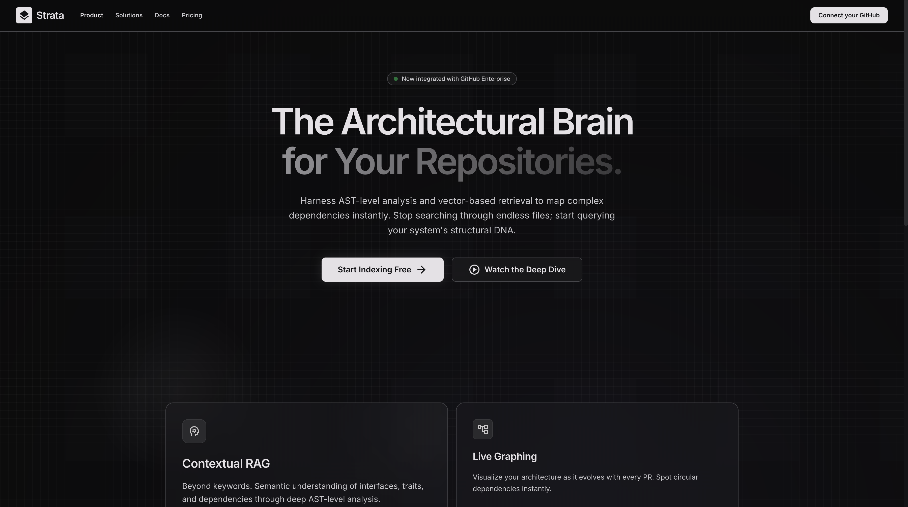
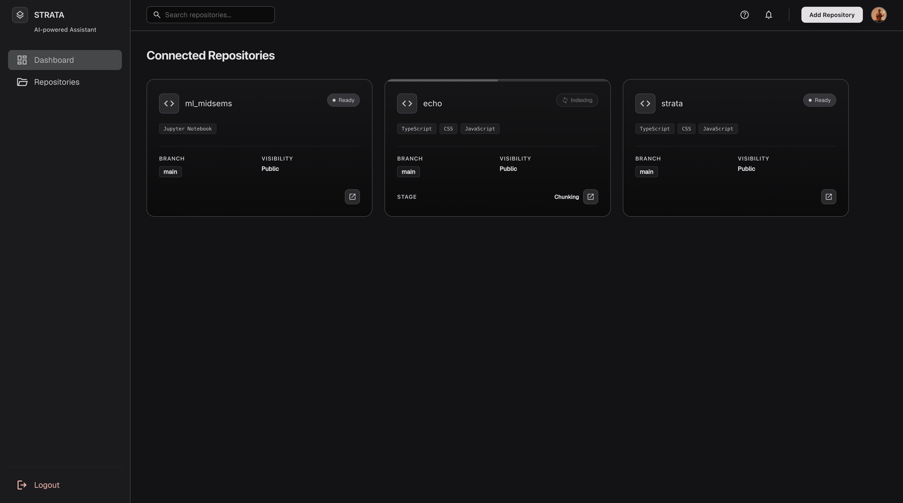
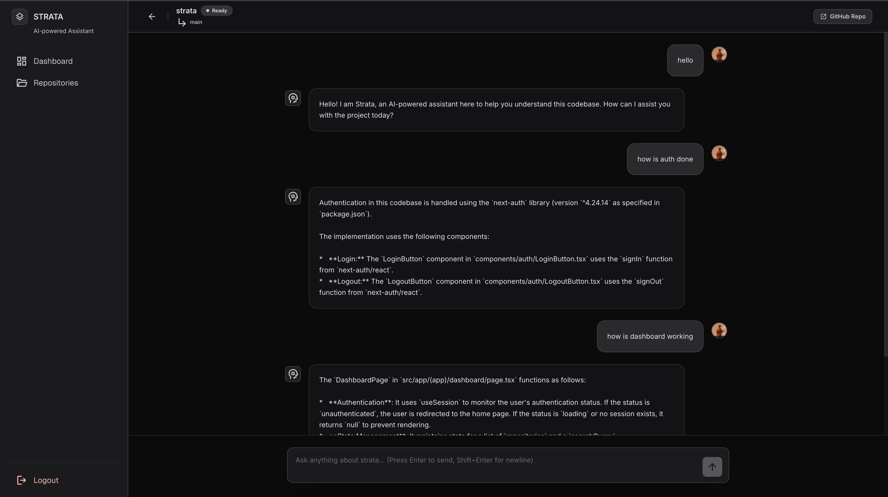
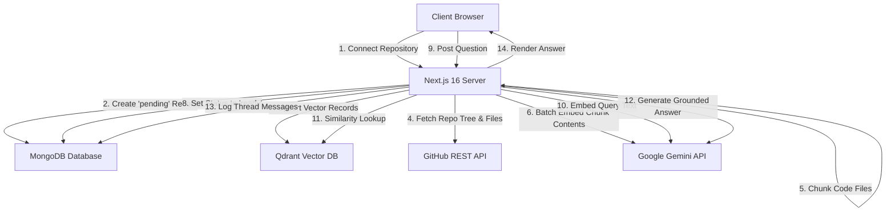
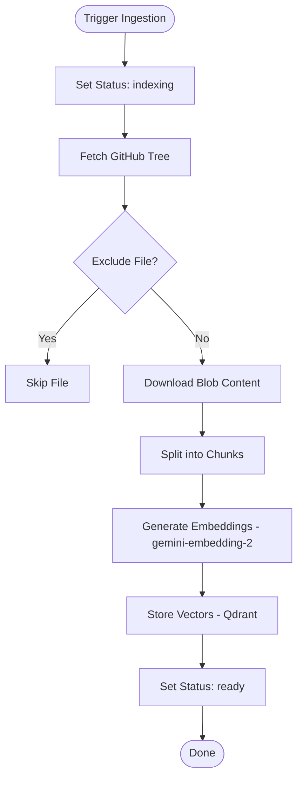
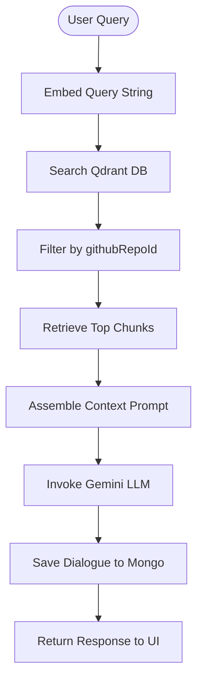

# Strata

### AI-Powered Codebase & Documentation Knowledge Assistant

Strata is an engineering tool designed to streamline repository navigation and accelerate developer onboarding. By connecting to public or private GitHub repositories, Strata extracts file trees, parses source code with language-aware text splitters, and produces dense vector embeddings. Through Retrieval-Augmented Generation (RAG) and the Google Gemini API, developers can run semantic natural language queries against their codebase and receive answers grounded directly in their source files.

---

<div align="center">

[](https://nextjs.org/)
[](https://react.dev/)
[](https://www.typescriptlang.org/)
[](https://www.mongodb.com/)
[](https://deepmind.google/technologies/gemini/)
[](https://qdrant.tech/)
[](LICENSE)

[Architecture](#architecture) • [Getting Started](#getting-started) • [API Overview](#api-overview) • [Database Models](#database-models) • [Engineering Decisions](#engineering-decisions)

</div>

---

## Problem Statement

When onboarding to a new codebase or examining an unfamiliar repository, developers face significant friction:
* **High Cognitive Load**: Understanding structural flows, architectural divisions, or tracing an API request path requires manually scanning hundreds of files.
* **Lexical Limitations**: Standard keyword search and `grep` fail to capture semantic context. Searching for terms like "authorization" will miss code referencing "authOptions", "jwt checks", or "session validators".
* **Onboarding Friction**: Explaining repository structure, configuration layouts, and pattern conventions takes up valuable time from senior engineering resources.

---

## Solution

Strata creates a local semantic interface to any repository. By translating code files into chunked semantic vector spaces, it allows developers to interact with the repository using natural language questions:
* **Direct Context Mapping**: Queries are mapped against code vectors to extract matching functions, classes, and comments.
* **Source-Grounded Answers**: LLM answers are generated based solely on the retrieved codebase chunks, reducing hallucinations.
* **Immediate Context Referral**: Responses reference actual source files, letting developers click and navigate straight to the destination lines.

---

## Product Overview

Strata runs a background orchestration pipeline to process repository files. The developer logs in using GitHub OAuth, adds a repository URL, and waits for background indexing to complete. Once indexed, the repository's chat becomes active, allowing multi-turn conversations about the codebase.

```
[GitHub OAuth] ──► [Connect Repository] ──► [Background Ingestion] ──► [Interactive Code Chat]
```

---

## Screenshots

### Landing Page
*Welcome page describing Strata's capabilities and providing GitHub OAuth login initiation.*



### Dashboard
*Allows developers to view their connected codebases, check indexing status, and add new repositories.*



### Chat Interface
*Interactive chat terminal with session-based persistent memory. Validates index state before enabling input.*



---

## Features

### Authentication & Sessions
* **GitHub OAuth Providers**: Integrates via NextAuth.js.
* **JWT Client Sessions**: Credentials and profile assets (avatars, tokens) are passed securely to Route Handlers and Server Actions.

### Repository Syncing & Pipelines
* **Public/Private Repo Access**: Resolves GitHub REST API requests using OAuth authorization headers.
* **Interactive State Engine**: Tracks repository progress using states (`pending`, `indexing`, `ready`, `failed`) and stages (`connecting`, `chunking`, `embedding`, `storing`).
* **Non-Blocking Execution**: Invokes ingestion pipelines asynchronously, avoiding Gateway Timeout constraints.
* **Index Retry Mechanism**: Allows developers to re-trigger failed repository indexing pipelines directly from the dashboard.

### Vector Storage & Code Retrieval
* **Syntax-Aware Chunking**: Splits files using AST parser-rules (via LangChain's `RecursiveCharacterTextSplitter.fromLanguage`) for supported languages, preserving function boundaries.
* **Dense Vectors**: Generates 3072-dimension vectors with Google's `gemini-embedding-2` model.
* **User Isolation Payloads**: Restricts similarity queries in Qdrant with filters on `githubRepoId` to prevent cross-tenant queries.
* **Grounded Answer Engines**: Forms codebase context using nearest-neighbor matches and completes requests using `gemini-3.1-flash-lite`.

### UX Safeguards
* **Locked Input State**: Automatically disables chat inputs unless a repository's status is `ready` to prevent querying incomplete indexes.
* **Autoscroll Message Logs**: Scroll locks the message containers dynamically as queries complete.

---

## Architecture

Strata is designed as a modular full-stack application built around the Next.js App Router.



### Data Pipeline Lifecycle

#### 1. Repository Indexing Pipeline


#### 2. RAG Query Lifecycle


---

## Tech Stack

### Core Framework
| Dependency | Version | Purpose |
| :--- | :--- | :--- |
| **Next.js** | `16.2.9` | Full-stack meta-framework, App Router, Route Handlers. |
| **React** | `19.2.4` | Component framework and React Server Actions. |
| **TypeScript**| `^5` | Strict static type definitions. |
| **TailwindCSS**| `^4` | Utility classes and styling definitions. |

### Data & Databases
| Dependency | Version | Purpose |
| :--- | :--- | :--- |
| **Mongoose** | `^9.7.2` | MongoDB object modeling and document validation. |
| **Qdrant Client** | `^1.18.0` | Node.js interface client for Qdrant Vector database operations. |

### Semantic Engines & Utilities
| Dependency | Version | Purpose |
| :--- | :--- | :--- |
| **`@google/genai`** | `^2.10.0` | Official Google SDK for Gemini LLMs and embedding systems. |
| **`@langchain/core`** | `^1.2.1` | Baseline interfaces for document structures and chains. |
| **`@langchain/textsplitters`**| `^1.0.1` | Language-aware code chunk segmentation. |
| **`next-auth`** | `^4.24.14` | GitHub OAuth session validation provider. |
| **`axios`** | `^1.18.1` | REST calls communicating with the GitHub API. |
| **`uuid`** | `^14.0.1` | Unique ID generation (UUID v5) for vector deduplication. |

---

## Project Structure

```text
strata/
├── components/                  # Client-side UI Components
│   ├── auth/                    # OAuth login controls
│   ├── chat/                    # Messaging client (ChatInput, MessageList, EmptyState)
│   └── dashboard/               # Dashboards, cards, modals, navigation headers
├── src/
│   ├── app/                     # Next.js App routing
│   │   ├── (app)/               # Authenticated page boundaries (dashboard, chat)
│   │   └── api/                 # Endpoint handlers (NextAuth, chat engines, reindexing APIs)
│   ├── context/                 # Context Providers (Session wrappers)
│   ├── embeddings/              # Batch wrapper tools for Google Gemini Embeddings
│   ├── github/                  # API clients retrieving file contents and tree listings
│   ├── ingestion/               # Pipeline modules handling files and syntax splitting
│   ├── lib/                     # Database client initializers (dbConnect)
│   ├── models/                  # Mongoose document schema validation definitions
│   ├── retrieval/               # Core RAG functions (search, prompt parsing, generation)
│   ├── types/                   # TypeScript interfaces
│   ├── validations/             # Request payload constraints
│   └── vectorstore/             # Vector connection builders and metadata indexes
├── package.json                 # Node modules definitions
├── tsconfig.json                # TypeScript compiler specifications
└── next.config.ts               # Next.js configurations
```

---

## Getting Started

### Prerequisites
* **Node.js** v18 or higher
* **MongoDB** instance
* **Qdrant** DB endpoint

### Setup Steps

1. **Clone the Repository**
   ```bash
   git clone https://github.com/rajdeep-2004/strata.git
   cd strata
   ```

2. **Install Dependencies**
   ```bash
   npm install
   ```

3. **Configure Environment Variables**
   Create a `.env.local` file in the root directory:
   ```env
   MONGO_URI="mongodb://localhost:27017/strata"
   GITHUB_ID="your_github_oauth_client_id"
   GITHUB_SECRET="your_github_oauth_client_secret"
   NEXTAUTH_SECRET="your_nextauth_signing_secret"
   GEMINI_API_KEY="your_google_gemini_api_key"
   NAMESPACE="your_uuid_v5_namespace_uuid"
   QDRANT_URL="https://your-qdrant-cluster.io"
   QDRANT_API_KEY="your_qdrant_db_api_key"
   ```

4. **Run the Development Server**
   ```bash
   npm run dev
   ```
   Open [http://localhost:3000](http://localhost:3000) to view the application.

5. **Build for Production**
   ```bash
   npm run build
   npm run start
   ```

---

## Environment Variables

| Variable | Description | Requirement |
| :--- | :--- | :--- |
| **`MONGO_URI`** | The connection string target for your MongoDB deployment database. | Required |
| **`GITHUB_ID`** | The Client ID identifier generated when creating your OAuth App on GitHub. | Required |
| **`GITHUB_SECRET`** | The Client Secret key generated for OAuth authentication on GitHub. | Required |
| **`NEXTAUTH_SECRET`** | Used by NextAuth to sign, encrypt, and secure cookies and session tokens. | Required |
| **`GEMINI_API_KEY`** | Google Gen AI token used to access `gemini-embedding-2` and `gemini-3.1-flash-lite`. | Required |
| **`NAMESPACE`** | A static UUID string used by UUID v5 to calculate deterministic vector keys. | Required |
| **`QDRANT_URL`** | The endpoint location target pointing to your Qdrant Vector database cluster. | Required |
| **`QDRANT_API_KEY`** | Authorization token allowing writes and searches on your Qdrant vector store. | Required |

---

## API Overview

### `POST /api/repositories`
Registers a repository in MongoDB, fetches metadata and languages, and initiates the ingestion pipeline asynchronously.
* **Payload**: `{ githubUrl: string }`
* **Response**: `201 Created` on registration.

### `GET /api/repositories`
Retrieves all repository records linked to the active session user's Mongoose ID.
* **Response**: `200 OK` with JSON array of metadata.

### `POST /api/repositories/[repoId]/chat`
Processes codebase queries. Runs a vector similarity lookup against Qdrant, builds a context-enhanced prompt, and calls Gemini for a response.
* **Payload**: `{ query: string, githubRepoId: string }`
* **Response**: `200 OK` with `{ success: true, answer: string }`.

### `POST /api/repositories/[repoId]/reindex`
Resets a failed repository record's state to `pending` and re-triggers the asynchronous ingestion pipeline.
* **Payload**: `{ repositoryId: string }`
* **Response**: `200 OK` with `{ success: true, message: "Retry indexing initiated" }`.

---

## Database Models

Strata defines three primary database collections using Mongoose schemas:

### 1. User (`UserModel`)
Tracks authenticated user details and GitHub API tokens:
* `githubId` (String, Unique, Required): User's GitHub profile identifier.
* `githubUsername` (String, Required): GitHub username.
* `email` (String, Unique, Required, Lowercase): Account email.
* `name` (String): User's display name.
* `avatarUrl` (String): Link to user's GitHub avatar.
* `access_token` (String): Active OAuth access token.

### 2. Repository (`RepositoryModel`)
Stores state and metadata for registered codebases:
* `userId` (ObjectId, Ref: User, Required): Owner identifier.
* `githubRepoId` (String, Required): GitHub Repository ID.
* `githubRepoUrl` (String, Required): Repository clone URL.
* `repoName` (String, Required): Display name.
* `githubRepoOwner` (String, Required): Organization/User username.
* `visibility` (Enum: public/private, Required): Repository privacy classification.
* `status` (Enum: pending/indexing/ready/failed, Default: pending): Processing state.
* `indexingStage` (Enum: connecting/chunking/embedding/storing): Stage within ingestion.
* `defaultBranch` (String, Required): Target branch.
* `languages` (Array of Strings): Identified coding languages.
* `lastIndexedAt` (Date): Timestamp of last indexing run.
* *Compound Index*: `{ userId: 1, githubRepoId: 1 }` (Unique).

### 3. Message (`MessageModel`)
Logs dialogue history for chat screens:
* `userId` (ObjectId, Ref: User, Required): Author owner identifier.
* `repositoryId` (ObjectId, Ref: Repository, Required): Target repository.
* `role` (Enum: user/assistant, Required): Speaker role.
* `content` (String, Required): Message text.
* *Compound Index*: `{ repositoryId: 1, createdAt: 1 }`.

---

## Engineering Decisions

### Dedicated Vector Search with Qdrant
Using Qdrant instead of generic database vector extensions allows for fast vector operations and native payload filtering. Multi-user isolation is maintained by creating payload keyword indexes on `githubRepoId` and applying strict filters to similarity searches, ensuring users only retrieve chunks from their authorized repositories.

### Asynchronous Ingestion Pipelines
Codebase processing tasks—cloning directories, filtering files, batching embedding requests—can easily exceed serverless or Route Handler execution limits (usually 15-60 seconds). To avoid timeouts, the API route registers the repository, immediately responds to the client with `201 Created`, and triggers the ingestion pipeline asynchronously.

### Structured Storage Hybrid (MongoDB + Vector DB)
Relational metadata (users, repository settings, conversational histories) is stored in MongoDB, which naturally accommodates unstructured chat logs. Heavy dense vector data is offloaded to Qdrant. This separation of concerns prevents index bloat and keeps document reads fast.

### Deterministic Vector Keys (UUID v5)
Vectors in Qdrant are upserted using UUIDs generated via UUID v5. The key is hashed using a constant `NAMESPACE` and a combination of `githubRepoId`, `filePath`, and `chunkIndex`. This guarantees that reprocessing a codebase overwrite generates matching IDs, avoiding vector duplication and facilitating easy cleanups.

---

## Security

* **OAuth Scopes**: Requests minimal read access from GitHub to list and pull files during ingestion.
* **Route Authentication Safeguards**: Server Actions and API endpoints inspect the NextAuth session token. Unauthorized attempts are rejected with `401 Unauthorized` before querying backend resources.
* **Tenant Isolation**: Database lookup filters on `userId` and vector searches in Qdrant verify `githubRepoId` parameters to prevent cross-user data leaks.

---

## Current Limitations

> [!WARNING]
> **Embedding Limit**: The ingestion pipeline limits embedding generation to the first 80 code chunks (`allChunks.slice(0, 80)` in `ingestionPipeline.ts`) to avoid rate limit constraints on the Gemini embedding API.
* **Single Conversation Thread**: The database schema links chat messages directly to a repository ID. As a result, users are limited to a single continuous chat thread per repository.
* **Blocking Responses**: Answers are returned as a single complete block. Streaming responses (Server-Sent Events/chunked HTTP transfers) are not supported.
* **No Repository Deletion API**: The repository management views do not currently expose endpoints or UI components to delete indexed codebases or vector indexes.

---

## Roadmap

### Completed
* [x] GitHub OAuth authentication.
* [x] Repository discovery dashboard.
* [x] Asynchronous background indexing.
* [x] Language-aware code chunking (via AST analysis).
* [x] Qdrant payload-based vector searches.
* [x] Context-grounded codebase chat.
* [x] Chat history persistence.
* [x] Input validation that disables chat inputs unless repository status is `ready`.
* [x] Failed index re-triggering endpoint.

### In Progress
* [ ] Syntax highlighting for code blocks in chat responses.
* [ ] Ingest failure logs and diagnostics screens.

### Planned
* [ ] Real-time response streaming for chat.
* [ ] Multi-thread conversations per repository.
* [ ] Webhook triggers to automatically sync repositories on GitHub push events.

---

## Contributing

1. **Fork the Repository**: Create a personal copy of the project.
2. **Create a Feature Branch**:
   ```bash
   git checkout -b feature/your-feature-name
   ```
3. **Commit Changes**: Follow semantic commit rules.
4. **Push & PR**: Open a Pull Request pointing to our default branch. Verify that your codebase compiles and has no active lints.

---

## License

This project is licensed under the MIT License. See the [LICENSE](LICENSE) file for details.
